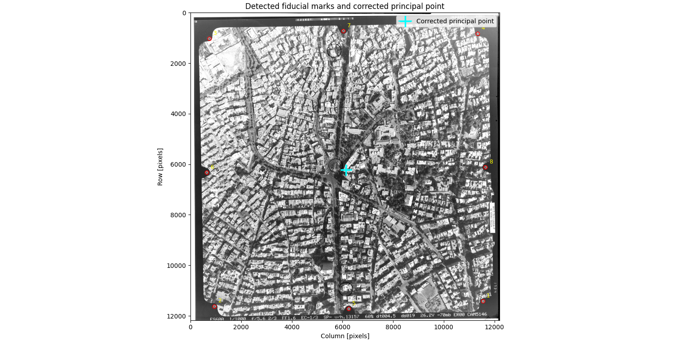

# Semi-Automatic Interior Orientation of an Aerial Photograph

This project performs the interior orientation of a scanned analog aerial photograph using the calibrated fiducial marks of a **Wild RC20** camera.

The program requires two initial fiducial measurements from the user. It then predicts and detects all eight fiducial marks, estimates affine and projective transformations between pixel and camera coordinates, and computes the fiducial center.



## Workflow

1. Load the grayscale aerial image and camera calibration file.
2. Select two fiducial marks manually or interactively.
3. Estimate a 2D conformal transformation.
4. Predict the locations of the remaining fiducial marks.
5. Refine all locations using normalized cross-correlation and subpixel peak estimation.
6. Estimate affine and projective transformations.
7. Compute the fiducial center from opposite fiducial pairs.

## Requirements

- Python 3
- NumPy
- OpenCV
- Matplotlib

Install the required packages with:

```bash
pip install numpy opencv-python matplotlib
```

## Usage

### Interactive selection

Select two fiducial marks in the graphical interface:

```bash
python3 interior_orientation.py 1614.tif RC20.txt \
  --click-ids 1 3 \
  --save-figure Figure_1.png
```

### Known initial coordinates

Alternatively, provide exactly two initial measurements as `ID ROW COLUMN`:

```bash
python3 interior_orientation.py 1614.tif RC20.txt \
  --manual 1 11421.45 11539.82 \
  --manual 3 1021.60 742.30 \
  --save-figure Figure_1.png \
  --no-show
```

Useful options include:

- `--template-size`: odd template size in pixels; default is `101`.
- `--search-radius`: local search radius in pixels; default is `50`.
- `--horizontal-pair` and `--vertical-pair`: override opposite fiducial pairs.
- `--external-template ID PATH`: use an external template for a fiducial.
- `--no-show`: save or calculate results without opening the final plot.

Run `python3 interior_orientation.py --help` for all options.

## Outputs

The program prints:

- Detected row and column of each fiducial mark
- Normalized cross-correlation scores
- Conformal transformation parameters
- Affine transformation matrix
- Projective homography
- RMSE values in millimeters
- Fiducial-center coordinates and offset from the image center

For the included dataset, the reported RMSE values are approximately:

| Model | RMSE |
|---|---:|
| Affine | 0.00972 mm |
| Projective | 0.00936 mm |

The sample numerical output is available in `results.txt`, and the full project description is provided in `bonus_photo_project_Ali_Behrouz.pdf`.

## Input Files

- `1614.tif`: scanned aerial photograph of Hamedan
- `RC20.txt`: Wild RC20 camera calibration data and fiducial coordinates
- `meta.txt`: image and flight metadata
- `interior_orientation.py`: processing and calculation program

The calibration reader supports either an RC-style file containing a `$FIDUCIALS` section or a CSV file with `id`, `X_mm`, and `Y_mm` columns.

## Limitation

The current implementation uses the calibrated fiducial coordinates but does not apply the calibrated focal length, principal-point-of-symmetry offset, or radial lens-distortion corrections. The reported point is therefore the **fiducial center**, not a complete calibrated principal point.

## Dataset

The original aerial image (`1614.tif`) used during development is not included in this repository because it exceeds GitHub's maximum file size.

To reproduce the experiments, place the original image in:

```
data/1614.tif
```

The remaining metadata files (`RC20.txt` and `meta.txt`) are included.